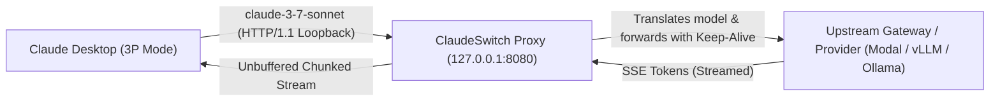

# ClaudeSwitch

**ClaudeSwitch** is a native macOS utility and menu suite designed for **Claude Desktop** (Anthropic 3rd-party inference interface, `deploymentMode: "3p"`). It enables you to seamlessly connect, switch between, and proxy custom LLM endpoints (Modal, Ollama, vLLM, LiteLLM, DeepSeek, AgentRouter, OmniRoute, and custom gateways) directly inside Claude Desktop.

---

## Key Features

- **Any Gateway & Custom Endpoint**: Connect Claude Desktop to local endpoints (Ollama, vLLM, LiteLLM) or remote providers (Modal, DeepSeek, AgentRouter, self-hosted gateways).
- **HTTP Loopback Proxy & HTTPS Bypass**: Claude Desktop strictly blocks remote non-loopback HTTP endpoints (*"must use https or http on loopback"*). ClaudeSwitch includes a built-in, lightweight loopback forwarder listening on `127.0.0.1` with:
  - **HTTP/1.1 Persistent Keep-Alive**: Prevents socket drops and watchdog timeouts.
  - **Zero-Latency Unbuffered Streaming**: Uses HTTP/1.1 Chunked Transfer Encoding to stream Server-Sent Events (SSE) tokens directly with zero buffering.
  - **Upstream Connection Pooling**: Reuses warm TCP connections to remote gateways for sub-second responses.
- **Wire Model Translation**: Claude Desktop enforces Anthropic model naming patterns (*"Doesn't look like an Anthropic model"*). ClaudeSwitch lets Claude Desktop send standard names (like `claude-3-7-sonnet`) while the proxy transparently translates requests to your upstream provider's model ID.
- **Schema Validation & UUID Fix**: Prevents Claude Desktop's internal `Error: unknown config id` and *"Couldn't update saved configurations"* by automatically generating and normalizing strict lowercase UUIDs and unescaped JSON.
- **Profile & Backup Management**:
  - Save multiple provider presets.
  - One-click profile switching with automatic Claude Desktop relaunch.
  - Automated timestamped backups before every configuration change with one-click restore.

---

## Requirements

- **macOS**: Sonoma (14.0+), Ventura (13.0+)
- **Architecture**: Apple Silicon (M1/M2/M3/M4) or Intel
- **Python**: Python 3.9+ (macOS default, Homebrew, or Xcode CLT)

---

## Installation & Build

### Option 1: Run Prebuilt App
1. Move `ClaudeSwitch.app` to your `/Applications/` folder:
   ```bash
   cp -R ClaudeSwitch.app /Applications/
   ```
2. Launch `ClaudeSwitch` from Applications or via Spotlight.

### Option 2: Build From Source
Compile the Swift and native assets with the included build script:
```bash
git clone https://github.com/xAmirHamza77/ClaudeSwitch.git
cd ClaudeSwitch
chmod +x ClaudeSwitchSource/build.sh
./ClaudeSwitchSource/build.sh
```
The compiled, signed `ClaudeSwitch.app` will be generated in the root directory.

### Option 3: Terminal Setup Script
If you prefer a pure shell script without the GUI, use `setup_claude_deepseek.sh`:
```bash
chmod +x setup_claude_deepseek.sh
./setup_claude_deepseek.sh --help
```

---

## How It Works



1. **Configuration**: ClaudeSwitch writes valid configuration files directly to `~/Library/Application Support/Claude-3p/configLibrary/` and `_meta.json`.
2. **Proxy Routing**: When using an external HTTP or non-Anthropic endpoint, Claude Desktop communicates with `http://127.0.0.1:8080`.
3. **Execution**: The local proxy rewrites the model parameter on the fly and streams tokens back into Claude's native UI in real time.

---

## Fast Model Presets

In the **HTTP Bypass Proxy** tab, you can select from optimized model translation presets:
- **⚡ Claude Sonnet**: Ultra-fast routing (~1.4s TTFB)
- **🚀 Claude No-Think**: Minimal overhead (~1.2s TTFB)
- **🔥 Gemini 2.5 Flash**: Fast inference (~1.2s TTFB)
- **Custom Model**: Forward directly to any specific model ID supported by your gateway.

---

## Security & Privacy

- **No Remote Telemetry**: ClaudeSwitch does not collect or transmit analytics.
- **Local Storage**: Credentials and API keys are stored solely in your local user Application Support directory and macOS `UserDefaults`.
- **Open Source**: Full Swift and Python source code is provided in `ClaudeSwitchSource/`.

---

## License

MIT License. See [LICENSE](LICENSE) for details.
